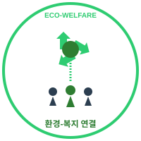

<!-- _class: cover -->
<!-- _paginate: false -->



# 환경-복지 연결
# 노인일자리 창출사업

## 사업계획서

<br/>

**작성자:** [학번] [이름]
**제출처:** [학교명]
**작성일:** 2025년 11월

---

# 회사소개

<div class="center-text">

**"환경과 복지의 선순환으로**
**모두에게 가치를 실현한다"**

</div>

<br/>

<div style="display: grid; grid-template-columns: 1fr 1fr 1fr; gap: 20px;">

<div class="box">

### 경제적 자립성
• 재활용 수익 창출
• 지역 순환경제
• 지속가능 재정

</div>

<div class="box">

### 환경적 가치
• 재활용률 향상
• 매립·소각 감소
• 탄소저감

</div>

<div class="box">

### 사회적 가치
• 고령층 일자리(60+)
• 세대간 지식 전수
• 취약계층 자립

</div>

</div>

---

# 창업배경 및 동기

<div style="display: grid; grid-template-columns: 1fr 1fr 1fr; gap: 20px;">

<div>

### <span class="red">노인 빈곤 위기</span>

• **노인빈곤율 39.8%**
  (출처: 통계청 2023)
• OECD 평균의 3배
• 기초연금 월 34.4만원 부족

</div>

<div>

### <span class="orange">환경 위기</span>

• **연 8,032만 톤 폐기물**
  (출처: 환경부 2023)
• 재활용률 저조
• 노인 고용 재활용업체 거의 없음

</div>

<div>

### <span class="green">통합모델 필요</span>

• 정부 노인일자리 109.8만개 확대
• 환경기업 지원 연 325억원
• 사회적기업 인증 확대

</div>

</div>

<br/>

<div class="footer-msg">

→ **환경 + 복지 통합 모델로 두 가지 사회문제를 동시 해결**

</div>

---

# 비즈니스 모델

## 가치사슬

<div style="text-align: center; font-size: 16pt; margin: 20px 0;">

**수거** → **선별** → **재가공** → **판매**

</div>

<div style="display: grid; grid-template-columns: 1fr 1fr 1fr 1fr; gap: 15px; margin: 30px 0;">

<div class="box">

**1. 수거**
• 가정
• 소상공인
• 정기계약처

</div>

<div class="box">

**2. 선별**
• 자동선별기
• 품목별 분류
• 오류율 ≤2%

</div>

<div class="box">

**3. 재가공**
• 업사이클
• 정제
• 품질 기준화

</div>

<div class="box">

**4. 판매**
• B2B
• B2C
• 기업 ESG

</div>

</div>

### 주력 제품군

| 제품 | 활용 재료 | 가격대 |
|------|-----------|--------|
| 재생 노트·메모지 | 폐지 | 5천~1만원 |
| 에코 화분·수납함 | 폐플라스틱 | 1만~2만원 |
| 에코백·파우치 | 폐섬유 | 1.5만~3만원 |

---

# 인력운영 계획

<div style="display: grid; grid-template-columns: 1fr 1.5fr; gap: 20px;">

<div>

### 조직 구조

```
대표(센터장)
 └─ 팀장 A (운영)
 └─ 팀장 B (재무·인사)
     ├─ 팀원 3-4명
     └─ 팀원 3-4명
```

**총 10명** (취약계층 70%)

<br/>

### 법적 준수사항

✓ 4대보험 가입
✓ 서면 근로계약
✓ 무기계약 전환 기준
✓ 최저임금 충족

</div>

<div>

### 인력 구성 및 급여

| 직급 | 인원 | 월급여 | 연봉 | 주요 역할 |
|------|------|---------|------|-----------|
| 대표 | 1명 | 230만원 | 2,760만원 | 조직 총괄, 대외 대표 |
| 팀장 A | 1명 | 215만원 | 2,580만원 | 현장 운영, 프로세스 개선, 안전관리 |
| 팀장 B | 1명 | 215만원 | 2,580만원 | 예산·회계, 정부지원금, 인사·노무 |
| 팀원 | 7명 | 210만원 | 17,640만원 | 현장운영 (60세 이상) |
| **합계** | **10명** | **2,130만원** | **25,560만원** | - |

### 정부지원 제도

**① 고령자 고용지원금** - 60세 이상, 연 840만원, 최대 2년
**② 사회적기업 일자리창출** - 취약계층 70%, 연 13,728만원, 예비2년+인증3년
**③ 전문인력 지원** - 팀장급 2명, 1차년 연 3,840만원, 최대 3년
**④ 사업개발비** - 설비·장비, 연 5천만원

</div>

</div>

---

# 온·오프라인 채널

<div style="display: grid; grid-template-columns: 1fr 1fr; gap: 30px;">

<div>

### 온라인 채널

• **자체 온라인몰** (1년차 하반기)
• **대형 플랫폼 입점** (2년차)
  - 쿠팡, 마켓컬리
• **SNS 마케팅**
  - 인스타그램, 블로그
• **글로벌 진출** (3년차+)

</div>

<div>

### 오프라인 채널

• **정기 수거**
  - 학교, 제조업체
• **박람회 참가** (연 2-3회)
  - 환경박람회
  - 사회적기업 박람회
• **체험 워크숍** (월 1회)
  - 업사이클 체험
• **기업 ESG 프로젝트**

</div>

</div>

<br/>

### 판로 구성 비중

| 구분 | 비중 |
|------|------|
| B2B (기업 대상) | 40% |
| B2C (개인 소비자) | 30% |
| 기업협력 (ESG) | 20% |
| 기타 | 10% |

---

# 연도별 인력 확대 계획

| 연도 | 인원 | 고령층 | 월인건비 | 정부지원 | 자부담 | 월매출목표 |
|------|------|--------|----------|----------|---------|------------|
| 1년차 | 10명 | 7명 | 2,130만원 | 1,534만원 | 596만원 | 800만원 |
| 2년차 | 12명 | 9명 | 2,556만원 | 1,792만원 | 764만원 | 1,500만원 |
| <span class="highlight">3년차</span> | <span class="highlight">15명</span> | <span class="highlight">10명</span> | <span class="highlight">3,195만원</span> | <span class="highlight">1,917만원</span> | <span class="highlight">1,278만원</span> | <span class="highlight">2,800만원</span> |
| 4년차 | 18명 | 12명 | 3,834만원 | 1,533만원 | 2,301만원 | 3,500만원 |
| 5년차 | 20명 | 14명 | 4,260만원 | 1,065만원 | 3,195만원 | 4,200만원 |

<br/>

<div style="display: grid; grid-template-columns: 1fr 1fr 1fr; gap: 20px;">

<div class="box">

### 【1단계】 기반 구축기
• 10명 → 12명 점진적 확대
• 재활용 중심 안정화
• 정부 지원 70%
→ 운영 노하우 축적

</div>

<div class="box">

### 【2단계】 전환기
• 15명 확대 (업사이클)
• 고마진 제품 본격 출시
• 정부 지원 60%
→ **손익분기점 달성** 🎯

</div>

<div class="box">

### 【3단계】 성장기
• 18명 → 20명 (2호점)
• 정부 지원 40% → 25%
• 다양한 판로 확보
→ 자립 경영 기반 확립

</div>

</div>

### 2호점 차별화 전략
**김포(본점)** = 수거·분류 중심 | **인천(2호점)** = 업사이클 제조·판매 중심

---

# 시장분석

### 시장 규모

| 구분 | 현황 | 5년후 전망 | 성장률 |
|------|------|------------|--------|
| 글로벌 재활용시장 | 79조원 | 100조원 | CAGR 5.2% |
| 국내 재활용시장 | 11조원 | 14조원 | CAGR 5% |
| 노인 경제활동인구 | 600만명 | 630만명 | 약 5% |

<br/>

<div style="display: grid; grid-template-columns: 1fr 1fr; gap: 30px;">

<div class="box">

### 경쟁 환경

• 기존 재활용업체 200개+
  (노인 고용 거의 없음)
• 노인일자리 제공기관 1,000개+
  (환경사업 연계 거의 없음)

</div>

<div class="box">

### 우리의 기회

• **환경×복지 통합모델 시장 공백**
• 정부 정책 지원 강화
• ESG 기업 협력 수요 증가

</div>

</div>

<br/>

<small>출처: 통계청, 환경부, 산업리포트</small>

---

# SWOT 분석

<div style="display: grid; grid-template-columns: 1fr 1fr; gap: 20px;">

<div style="border: 3pt solid #2ECC71; padding: 20px; border-radius: 10px;">

### <span class="green">Strength (강점)</span>

• 정부 지원금 접근성 높음
• 사회적 가치 우수
• 통합모델로 경쟁 낮음

**대응전략:** 정부 지원 최대 활용 + 사회적 가치 마케팅

</div>

<div style="border: 3pt solid #F39C12; padding: 20px; border-radius: 10px;">

### <span class="orange">Weakness (약점)</span>

• 초기 투자 6,500만원 필요
• 사업 경험 부족
• 정부 지원 필수

**대응전략:** 단계적 투자 + 멘토링 + 정부 지원 다각화

</div>

<div style="border: 3pt solid #3498DB; padding: 20px; border-radius: 10px;">

### <span class="blue">Opportunity (기회)</span>

• 노인일자리 정책 확대
• 환경기업 지원 확대
• ESG 수요 증가

**대응전략:** 정책 연계 강화 + B2B ESG 협력 확대

</div>

<div style="border: 3pt solid #95A5A6; padding: 20px; border-radius: 10px;">

### <span class="gray">Threat (위협)</span>

• 정책 변화 리스크
• 대형업체 진입 가능
• 가격 경쟁 심화

**대응전략:** 다채널 운영 + 차별화(사회적 가치) + 품질 우위

</div>

</div>

---

# 마케팅 전략

<div style="display: grid; grid-template-columns: 1fr 1fr 1fr; gap: 20px;">

<div class="box">

### [B2B 기업]

• 폐기물 처리 비용 절감
• ESG 경영 목표 달성 지원
• 정기 수거 계약
• 업사이클 제품 B2B 공급

</div>

<div class="box">

### [B2C 소비자]

• 친환경 제품 구매 욕구
• 사회적 가치 소비 참여
• 노인 일자리 기여 인식
• 합리적 가격의 업사이클 제품

</div>

<div class="box">

### [B2G 정부]

• 노인 고용 확대 정책 부합
• 환경 정책 목표 달성 기여
• 사회적기업 육성 정책 연계
• 지역경제 활성화

</div>

</div>

<br/>

### 홍보 전략 및 예산

<div style="display: grid; grid-template-columns: 1fr 1fr; gap: 30px;">

<div>

**온라인 마케팅**
• SNS 운영: 인스타 주3회, 블로그 월8회
• 온라인 광고: 네이버, 페이스북
• 이메일 뉴스레터 (월 1회)

</div>

<div>

**오프라인 마케팅**
• 전시회 참가 (연 2-3회)
• 체험 프로그램 (월 1회)
• 언론 홍보 (연 4회)

</div>

</div>

**연간 마케팅 예산:** 1,200만원 (온라인 50% | 오프라인 33% | 콘텐츠 17%)

---

# 운영계획

### 시설 및 생산 능력

| 항목 | 1년차 | 2-3년차 | 4-5년차 |
|------|-------|---------|---------|
| 부지 규모 | 300㎡ | 500㎡ | 800㎡+ |
| 수거센터 | 1개소 | 1개소 | 2개소 |
| 선별 능력 | 월 12톤 | 월 24톤 | 월 40톤 |

<br/>

### 운영 프로세스

<div style="text-align: center; font-size: 16pt; margin: 20px 0;">

**수거** → **선별** → **포장** → **저장** → **판매** → **정산**

</div>

### 품질 관리 체계

| 단계 | 기준 | 점검주기 |
|------|------|----------|
| 수거 | 이물질 ≤5% | 일일 |
| 선별 | 분류 오류율 ≤2% | 일일 |
| 보관 | 화재 위험 점검 | 주 1회 |
| **목표** | **ISO 14001 인증 취득** | **3년차 심사, 4년차 취득** |

---

# 조직 및 거버넌스

<div style="display: grid; grid-template-columns: 1fr 1fr; gap: 30px;">

<div>

### 조직 구조

```
대표(센터장)
 ├─ 수집팀 (팀원 3명)
 │   - 재활용품 수거·분류
 ├─ 선별팀 (팀원 2명)
 │   - 품질 관리·재가공
 └─ 판매팀 (팀원 2명)
     - 온·오프라인 판매
     - 고객관리
```

<br/>

### 회계 투명성 시스템

| 주기 | 관리 방법 |
|------|-----------|
| 일일 | POS 시스템 자동 기록 |
| 월 1회 | 센터장 내부 검증 |
| 분기별 | 외부 모니터링 |
| 연 1회 | 전체 외부감사 |

</div>

<div>

### ESG 거버넌스 체계

<div class="box">

**E (환경)**
• 환경영향평가위원회
• 분기별 재활용률 점검
• 탄소감축 목표 모니터링

</div>

<div class="box">

**S (사회)**
• 사회가치평가위원회
• 고용 다양성 지표 관리
• 지역사회 기여도 평가

</div>

<div class="box">

**G (지배구조)**
• 이해관계자 참여 이사회
• 재무정보 공개 (연 1회)
• 사회적 감사 실시

</div>

</div>

</div>

**리스크 관리 전략:** 정책변동(다채널 확보) | 원재료(복수 공급처) | 인력이탈(분기 만족도 조사)

---

# 5년 추진계획

| 연도 | 주요 과제 | 월매출 | 인력 | 손익 |
|------|-----------|--------|------|------|
| **1년차** | 센터 개소<br/>예비사회적기업 지정<br/>수거 네트워크 구축 | 800만원 | 10명 | -700만원 |
| **2년차** | 온라인몰 오픈<br/>파트너십 확대 | 1,500만원 | 12명 | -456만원 |
| **3년차** | 사회적기업 인증 ✅<br/>업사이클 본격화<br/>**손익분기점 달성** | 2,800만원 | 15명 | <span class="green">+155만원</span> |
| **4년차** | 2호점 준비<br/>ISO 14001 추진 | 3,500만원 | 18명 | <span class="green">+233만원</span> |
| **5년차** | 2호점 운영<br/>지역 허브 구축 | 4,200만원 | 20명 | <span class="green">+72만원</span> |

<br/>

### 핵심 지표 (5년 누적)

💰 **경제:** 누적 매출 약 39억원 | 정부 의존 72%→25%
👥 **사회:** 고용 10→20명 | 고령층 7→14명 | 취약계층 비율 70% 유지
🌱 **환경:** 누적 재활용 1,200톤 | CO₂ 감축 600톤 | 업사이클 제품 20종

---

# 5개년 재무계획 및 손익분기점

### 초기 투자 (총 6,500만원)

| 항목 | 금액 | 비고 |
|------|------|------|
| 부동산 보증금 | 2,000만원 | 사무실·창고 |
| 임차료 선납 | 180만원 | 3개월 |
| 자동선별기(중고) | 1,500만원 | 사업개발비 |
| 수거차량(중고) | 2,000만원 | 사업개발비 |
| 포장재·자재 | 500만원 | - |
| 운영자금 | 320만원 | 초기 3개월 |

### 5개년 손익계획표 (단위: 만원)

| 구분 | 1년차 | 2년차 | 3년차 | 4년차 | 5년차 |
|------|-------|-------|-------|-------|-------|
| **[수입]** | | | | | |
| 매출액 | 9,600 | 18,000 | 33,600 | 42,000 | 50,400 |
| ├ 재활용품 | 4,800 | 7,200 | 13,440 | 16,800 | 20,160 |
| ├ 업사이클 | 3,600 | 8,400 | 16,800 | 20,160 | 24,192 |
| └ B2B/B2G | 1,200 | 2,400 | 3,360 | 5,040 | 6,048 |
| 정부지원금 | 18,408 | 21,504 | 23,004 | 18,396 | 12,780 |
| **총수입** | **28,008** | **39,504** | **56,604** | **60,396** | **63,180** |

---

# 5개년 재무계획 (계속)

| 구분 | 1년차 | 2년차 | 3년차 | 4년차 | 5년차 |
|------|-------|-------|-------|-------|-------|
| **[지출]** | | | | | |
| 인건비 | 25,560 | 30,672 | 38,340 | 46,008 | 51,120 |
| 운영비 | 10,848 | 14,304 | 16,404 | 11,592 | 11,196 |
| ├ 임차·관리 | 3,600 | 3,600 | 3,600 | 5,400 | 5,400 |
| ├ 차량·설비 | 2,400 | 3,600 | 4,800 | 4,800 | 4,800 |
| ├ 재료비 | 3,600 | 5,400 | 6,600 | - | - |
| └ 교육·홍보 | 1,248 | 1,704 | 1,404 | 1,392 | 996 |
| **총지출** | **36,408** | **44,976** | **54,744** | **57,600** | **62,316** |
| | | | | | |
| **연간 손익** | <span class="red">-8,400</span> | <span class="red">-5,472</span> | <span class="green">+1,860</span> | <span class="green">+2,796</span> | <span class="green">+864</span> |
| **누적 손익** | <span class="red">-8,400</span> | <span class="red">-13,872</span> | <span class="red">-12,012</span> | <span class="red">-9,216</span> | <span class="red">-8,352</span> |

<br/>

### 재정 전략 및 지속가능성

**【1-2년차】 기반 구축기** - 정부 지원 70% 의존 | 연평균 적자 7천만원
**【3년차】 전환기** - 업사이클 본격화 | **손익분기점 달성** 🎯
**【4-5년차】 성장기** - 정부 지원 25% 감소 | 연평균 흑자 1,800만원
**【6년차 이후】** - 완전 자립 경영 | 누적 적자 상환 완료

---

# 결론 및 기대효과

<div style="display: grid; grid-template-columns: 1fr 1fr; gap: 20px;">

<div class="box">

### 사회적 효과

• 5년 누적 **120명·년 참여**
• **최저임금 이상** 소득 보장
• 세대통합 및 공동체 활성화

</div>

<div class="box">

### 환경적 효과

• 누적 재활용 **1,200톤**
• CO₂ 감축 **600톤**
• 지역 재활용률 **+5%p** 기여

</div>

<div class="box">

### 경제적 효과

• 고정직 **20명** + 다수 간접 고용
• 월 **4,200만원** 지역 소비
• 지속가능한 수익 모델

</div>

<div class="box">

### 정책 부합성

• 노인일자리 정책 기여
• 환경부 ESG 정책 부합
• **UN SDG 목표** 부합
  (SDG 8, SDG 12)

</div>

</div>

<br/><br/>

<div style="background-color: #F8F9FA; padding: 30px; text-align: center; border-radius: 10px;">

## "환경과 복지를 연결하여
## 지속가능한 사회적 가치를 실현합니다"

</div>

---

<!-- _class: cover -->
<!-- _paginate: false -->

<br/><br/><br/>

# 감사합니다

<br/>

**문의사항이 있으시면 언제든지 연락 주시기 바랍니다**

